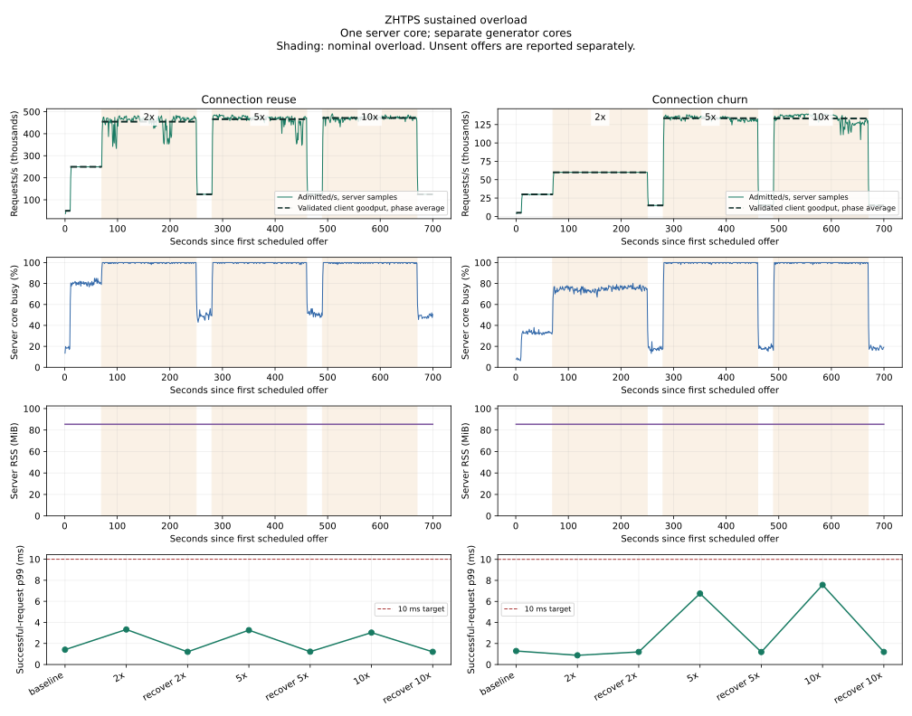

# Sustained overload validation

> Artifact retention: [Run summaries and setup records](runs/README.md) are retained.
> Raw traces, binaries, profiles, and source snapshots were removed.
> Artifact paths and restoration commands below describe the original runs.

Measured on September 11, 2026. These experiments exercise the built-in six-byte
`GET /` response on loopback. They establish behavior for this workload and
configuration; they do not establish a production application's capacity.

**ZHTPS preserves useful throughput under the saturation reached here, keeps
server memory flat, and recovers without restarting. The stronger goal remains
unproven:** the bounded generator cannot deliver all nominal excess offers,
connection overflow often fails at a one-second client timeout, and the tested
HTTP rate caps do not create CPU headroom under overload.

These measurements retain the earlier implementation's behavior. The subsequent
[direct-server admission report](native-admission.md) covers native early closure,
bodyless 503 connection reuse, and optional same-host SYN protection without an
HTTP proxy.

## Method

The server is Zig 0.16.0 ReleaseSafe, with access logging disabled, on an AMD
Ryzen AI Max+ 395 (16 physical cores, 32 logical CPUs), Linux
`7.2.4-arch1-2-strixhalo`. The client is built with Go
`go1.27.1-X:nodwarf5`. The main trials place one server worker on CPU 0, the
generator on physical CPUs 1–7, and the supervisor on CPU 8. CPU placement
explains a busy CPU 0 beside several partially occupied generator cores; total
machine utilization is not the server's available headroom.

Each worker has 512 public connection slots. Effective automatic admission is
384 active requests, 64 concurrent rejections, and a 384-request burst. The
default rejection rate is 1,000/s per worker. Request rate limiting is disabled
unless a trial explicitly enables it. The public listener's backlog is 128.
Routine keep-alive turnover is disabled with `--max-requests 4294967295`.

The Go driver schedules offers independently of completed responses. It has
512 network workers, four scheduler shards, 128 queued offers per shard, a
10 ms maximum delay before starting I/O, and a one-second network deadline.
There is one outstanding request per network worker and no HTTP pipelining.
Every successful response must have status 200, length six, and body `ZHTPS\n`.

This finite generator can shed work before sending it. **An unsent offer is
neither a server rejection nor proof that the server received that load.**
The reports distinguish scheduled offers, locally written requests, validated
successes, HTTP failures, transport failures, and generator drops/expirations.
The sum of all terminal outcomes must equal the scheduled offer count.

Goodput counts successes scheduled in a phase and completed before that phase
ends, divided by the fixed phase duration. Successful-request, HTTP-rejection,
and transport-failure latency starts at the intended offer time, including
generator waiting. Successful service latency is also recorded separately.
Histograms have less than 0.8% upward quantile rounding. Requests that finish
after their phase ends remain in that phase's outcome/latency cohort.

Calibration uses an explicit working target: at least 99.9% of scheduled offers
succeed and successful-request p99 is at most 10 ms. Initially assumed for these
measurements, the target has now been confirmed for the built-in `GET /`
validation. It is a test criterion, not a promise made by the server. The chosen baselines are conservative
rates meeting that target, rather than the highest observed goodput.

Every main trial has a 10-second warmup, a 60-second baseline, and 180 seconds
each at nominal 2×, 5×, and 10× baseline. Each overload phase is followed by
30 seconds at half baseline. The same server and client processes continue
through all phases; recovery does not restart the server or reset clients.

The harness samples server/client process CPU, server-core total busy time,
resident memory, descriptors, admin metrics, and kernel TCP counters once per
second. RSS excludes kernel socket memory. TCP counters and socket totals cover
the network namespace, so their deltas are supporting evidence rather than
exact counts of this server's failed connections. Affinity separates process
placement, but kernel networking, caches, memory bandwidth, and thermal limits
remain shared on this host.

## Calibration

| Mode | Offered/s | Successful/s | Successful offers | Success p99 | Duration |
| --- | ---: | ---: | ---: | ---: | ---: |
| Reuse, 14 generator cores | 250,000 | 249,989 | 99.996% | 1.38 ms | 10 s |
| Reuse, 14 generator cores | 300,000 | 299,352 | 99.793% | 4.36 ms | 10 s |
| Reuse, 7 generator cores | 250,000 | 249,961 | 99.984% | 1.34 ms | 15 s |
| Reuse, 7 generator cores | 300,000 | 299,841 | 99.947% | 1.46 ms | 15 s |
| Reuse, 7 generator cores | 450,000 | 426,476 | 94.776% | 3.33 ms | 15 s |
| Churn, corrected source binding | 30,000 | 29,984 | 99.946% | 1.33 ms | 10 s |
| Churn, corrected source binding | 50,000 | 49,885 | 99.772% | 1.20 ms | 10 s |
| Churn, corrected source binding | 120,000 | 119,640 | 99.709% | 2.92 ms | 10 s |

This selects **250,000/s for reuse** and **30,000/s for churn** as conservative
baselines. Churn's baseline is constrained by successful connection establishment,
not simply by HTTP processing throughput. The trials are short and their results
vary with generator placement; they are not confidence intervals or proof of a
maximum sustainable rate. See the [calibration summary](runs/overload.json "Summary of docs/overload/calibration-summary.json; raw artifact retired").

The [first churn pilot](runs/overload.json "Summary of docs/overload/calibration-churn.json; raw artifact retired") is explicitly excluded
from server-capacity conclusions. Binding source IPs before connecting caused
ephemeral-port allocation stalls as TIME_WAIT accumulated, consuming generator
CPU while the server was mostly idle. The corrected driver uses 16 loopback
source IPs and Linux `IP_BIND_ADDRESS_NO_PORT` to defer port allocation until
connect. This socket option's contract is documented in the
[Linux manual](https://www.man7.org/linux/man-pages/man7/ip.7.html).
No host TCP sysctls were changed. The corrected results are in
[the replacement pilot](runs/overload.json "Summary of docs/overload/calibration-churn-deferred-bind.json; raw artifact retired").

## Sustained connection reuse

| Phase | Scheduled/s | Locally written/s | Successful/s | Unsent offers | Success p99 | HTTP rejection p99 |
| --- | ---: | ---: | ---: | ---: | ---: | ---: |
| Baseline, 60 s | 250,000 | 249,936 | 249,839 | 0.026% | 1.41 ms | 6.78 ms |
| 2×, 180 s | 500,000 | 455,058 | 454,788 | 8.988% | 3.33 ms | 9.83 ms |
| 5×, 180 s | 1,250,000 | 466,254 | 466,017 | 62.700% | 3.26 ms | 9.76 ms |
| 10×, 180 s | 2,500,000 | 471,767 | 471,572 | 81.129% | 3.03 ms | 11.01 ms |

Server goodput reaches a plateau without collapsing over the nine minutes of
overload. The server core is about 99.8% busy during each overload phase, while
server RSS stays at 85.38 MiB. All admin scrapes succeed; the run records no
increase in listen overflows and no server I/O errors.

Recovery at 125,000/s delivers 124,985, 124,981, and 124,987 successful responses/s
after the respective overload phases. Each recovery has at least 99.985%
successful offers and p99 at most 1.23 ms. Thus recovery meets the chosen target
without restarting processes.

The major qualification is the load delivered: at nominal 10×, only about
472,000 requests/s are written to local sockets. The bounded generator drops
or expires 81% of scheduled offers as its network workers fall behind. These
results demonstrate service continuity under sustained saturation with bounded
client backpressure. They do not demonstrate receiving 2.5 million requests/s
and promptly rejecting two million of them. A sender that pipelines or a large
population of independent clients can impose a different cost.

Raw results: [full report](runs/overload.json "Summary of docs/overload/sustained-persistent.json; raw artifact retired"),
[phase summary](runs/overload.json "Summary of docs/overload/sustained-persistent-summary.json; raw artifact retired").

## Sustained connection churn

Each request opens a new TCP connection. HTTP admission remains at its automatic
concurrency settings, with request rate limiting disabled.

| Phase | Scheduled/s | Locally written/s | Successful/s | Unsent offers | Success p99 | Transport-failure p99 |
| --- | ---: | ---: | ---: | ---: | ---: | ---: |
| Baseline, 60 s | 30,000 | 29,984 | 29,984 | 0.029% | 1.29 ms | 1,011 ms |
| 2×, 180 s | 60,000 | 59,984 | 59,984 | 0.0001% | 0.88 ms | 1,009 ms |
| 5×, 180 s | 150,000 | 133,585 | 133,584 | 10.693% | 6.75 ms | 1,007 ms |
| 10×, 180 s | 300,000 | 133,264 | 133,263 | 55.453% | 7.57 ms | 1,011 ms |

Churn reaches approximately 133,000 successful responses/s without a progressive
collapse. The 5× and 10× phases fully occupy CPU 0 when kernel work is counted
(99.8% busy), although ZHTPS process CPU averages only 0.54 cores. Server RSS
remains 85.38 MiB, with no failed admin scrapes or server I/O errors.

All three recovery phases at 15,000/s deliver at least 14,999.6 successful
responses/s, with at least 99.997% successful offers and p99 below 1.20 ms.
The 60,000/s phase also meets the baseline target over three minutes; the short
calibration's 30,000/s choice was conservative, not a physical capacity ceiling.

The failure behavior misses the ideal of immediate overflow failure. There are
67,739 dial timeouts during 5× and 67,876 during 10×, plus small numbers of
read/write timeouts. Failure p99 is near the driver's one-second deadline.
Longer client deadlines could yield longer failure latency. The network namespace
records 176,837 additional listen overflows/drops across the run. These counters
can include retransmissions and are not a count of distinct client attempts.
There are **zero HTTP admission rejections** in this trial.

Consequently, connection-establishment pressure can be visible in kernel counters
while HTTP rejection and application connection-refusal counters stay at zero.
The application cannot count every packet or attempt that fails before an accept
completes. HTTP admission runs after a request head is received and parsed; it
does not bound the earlier TCP handshake and kernel processing cost.

Raw results: [full report](runs/overload.json "Summary of docs/overload/sustained-churn.json; raw artifact retired"),
[combined phase summary](runs/overload.json "Summary of docs/overload/sustained-summary.json; raw artifact retired").



## Admission rate comparison

Two additional trials retain the same single-worker configuration, including
the automatic burst of 384 and rejection response budget of 1,000/s. They set
`--rate 250000` and `--rate 350000`, respectively. Each has a 10-second warmup,
15 seconds at 125,000/s, 60 seconds at 500,000/s, and 15 seconds of recovery at
125,000/s. The uncapped comparison is the 180-second 500,000/s phase above.
These are individual observations with different phase durations, not repeated
statistical estimates of an optimum.

| Per-worker rate cap | Successful/s | Success p99 | HTTP rejection p99 | Server core busy | Unsent offers |
| --- | ---: | ---: | ---: | ---: | ---: |
| Disabled | 454,788 | 3.33 ms | 9.83 ms | 99.78% | 8.99% |
| 250,000/s | 249,748 | 3.49 ms | 3.69 ms | 99.76% | 27.21% |
| 350,000/s | 347,492 | 3.82 ms | 4.29 ms | 99.41% | 17.82% |

Both caps enforce the admitted-work ceiling and both recover above 99.97%
successful offers with p99 below 1.25 ms. Server RSS remains flat at approximately
85.4 MiB, with successful admin scrapes throughout.

However, neither cap leaves CPU headroom under sustained excess traffic. Server
counters record about 113,889 rejections/s with the 250,000 cap and 62,880/s with
the 350,000 cap. About 1,016/s reach the client as HTTP 503s, consistent with the
configured rejection token budget plus burst allowance. Most other rejected
requests appear as EOF. Each close drives reconnect work, and both capped trials
also record dial timeouts and listen overflows. Transport-failure p99 is 3.69 ms
and 4.85 ms respectively, but that percentile conceals tens of thousands of
one-second dial timeouts among millions of fast EOF failures.

The measured caps reduce successful throughput without reducing total core
occupancy under overload. This supports keeping rate limiting optional for this
cheap handler; it does not imply rate limiting is useless for expensive
application work. Admission protects body processing and handler work only after
the connection and request head have already incurred costs.

Raw results: [250,000/s cap](runs/overload.json "Summary of docs/overload/rate-250k.json; raw artifact retired"),
[350,000/s cap](runs/overload.json "Summary of docs/overload/rate-350k.json; raw artifact retired"), [comparison summary](runs/overload.json "Summary of docs/overload/rate-summary.json; raw artifact retired").

## Four-worker crosscheck

A shorter additional trial places four workers on CPUs 0–3, the generator on
CPUs 4–14, and the supervisor on CPU 15. Each worker retains 512 connection
slots and automatic admission; 1,024 client network workers and eight scheduler
shards leave connection-distribution headroom. This is a scaling crosscheck,
not another three-minute overload sweep.

| Scheduled/s | Duration | Successful/s | Unsent offers | Success p99 | Mean server-core busy |
| --- | ---: | ---: | ---: | ---: | ---: |
| 500,000 | 20 s | 498,130 | 0.374% | 2.02 ms | 64.5% |
| 1,000,000 | 20 s | 936,875 | 6.308% | 7.41 ms | 80.4% |
| 1,500,000 | 60 s | 1,130,500 | 24.633% | 7.83 ms | 92.4% |
| 250,000, recovery | 20 s | 249,963 | 0.015% | 1.39 ms | 38.2% |

All requests actually written during these four phases succeed, with zero HTTP
admission rejections. The missing scheduled traffic is unsent generator work,
so even the 500,000/s phase misses the chosen 99.9%-of-offers baseline target.
This limits conclusions about physical server capacity. Server RSS stays at
334.92 MiB, admin scrapes succeed, and the process exits cleanly. The four
workers admit between 24.56 million and 26.53 million requests each across the
whole run, showing work distributed to every worker.

Observed peak goodput is about 2.4× the one-worker plateau with this different
generator/configuration, not evidence of linear scaling. A production aggregate
rate should be calibrated with its actual worker count rather than multiplying
one isolated worker's peak. See the [full report](runs/overload.json "Summary of docs/overload/workers-4.json; raw artifact retired") and
[phase summary](runs/overload.json "Summary of docs/overload/workers-4-summary.json; raw artifact retired").

## What the numbers support changing

* Keep automatic **concurrency counts relative to per-worker connection slots**.
  The tested 512-slot worker resolves to 384 active requests, 64 concurrent
  rejections, and burst 384. These are resource bounds, not a CPU-utilization
  controller. These measurements do not isolate a better concurrency ratio.
* Do not derive a universal requests/s value from worker or connection counts.
  This handler sustains roughly 455,000–472,000 successful requests/s with reuse,
  versus roughly 133,000/s with a new connection per request. Application cost,
  transport behavior, and kernel work materially change capacity.
* For this one-core reuse workload, **250,000 arrivals/s is a measured starting
  point when about 20% CPU headroom is desired**: its uncapped 60-second baseline
  uses about 80% of the server core and meets the chosen success/latency target.
  That requires controlling arrivals before this server does their work. Setting
  ZHTPS's `--rate 250000` while delivering overload does not achieve that headroom.
* Treat a connection-establishment budget separately from an HTTP request budget.
  The 60,000 new connections/s phase meets the chosen target for three minutes
  and uses about 75% of the server core, but still has 2,813 dial timeouts.
  It is a workload-specific starting point, not a zero-loss connection limit.
* Preserve the bounded rejection policy. Raising the 1,000/s HTTP rejection
  budget has not been validated here; simply sending more 503s or accepting and
  closing more sockets is not evidence of better overload performance.

For the stronger goal of sustained peak throughput with prompt failure of every
excess arrival, the next work is shedding connection/request traffic before
expensive kernel/application processing and validating that policy with a
separate generator host. The sender must demonstrate the actual attempted and
delivered rates, with sufficient independent clients or pipelining to expose
backpressure. Repeat with realistic handlers, payloads, logging, connection
lifetimes, and worker counts; include failure tails beyond p99. This run does
not justify a universal nonzero request-rate default or a claim of linear
per-worker scaling.

## Reproduction and verification

Build commands and driver semantics are in [bench/README.md](../bench/README.md).
The main schedules can be reproduced with:

```sh
python3 bench/overload.py --output docs/overload/sustained-persistent.json \
  --client-cpus 1-7 --shards 4 \
  --schedule 50000:10s,250000:60s,500000:180s,125000:30s,1250000:180s,125000:30s,2500000:180s,125000:30s \
  --labels warmup,baseline,overload_2x,recovery_2x,overload_5x,recovery_5x,overload_10x,recovery_10x
python3 bench/overload.py --output docs/overload/sustained-churn.json \
  --client-cpus 1-7 --shards 4 --source-ips 16 --churn \
  --schedule 5000:10s,30000:60s,60000:180s,15000:30s,150000:180s,15000:30s,300000:180s,15000:30s \
  --labels warmup,baseline,overload_2x,recovery_2x,overload_5x,recovery_5x,overload_10x,recovery_10x
```

Each report preserves exact commands, effective configuration, toolchain versions,
source/binary SHA-256 hashes, worker snapshots, and one-second resource samples.
The companion `.client.json` is the driver's original output; `.server.log` and
`.client.log` preserve diagnostics. Run experiments sequentially to avoid sharing
the benchmark cores. Existing report paths are overwritten on rerun; choose new
output names to preserve the checked-in observations.

The main trials validate 277,367,705 responses with reuse and 62,028,901 with
churn. Both processes exit cleanly. The summarizer checks exact offer accounting
and clean server exit before accepting a report. All eight Go client tests pass
with the race detector, including real HTTP tests for bounded unsent work,
connection reuse, churn, failure classification, recovery, and deferred source
port allocation. The source-port test also fails against an isolated copy with
the former early-binding behavior and passes unchanged when the socket option
is restored. Python harness/report scripts pass bytecode compilation.

```sh
GOCACHE=/tmp/zhtps-go-cache go test -race bench/load/main.go \
  bench/load/offered.go bench/load/main_test.go bench/load/offered_test.go
python3 bench/summarize_overload.py docs/overload/sustained-persistent.json \
  docs/overload/sustained-churn.json --output docs/overload/sustained-summary.json
```
