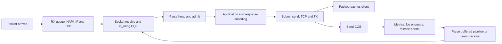

**Request critical-path review — 2026-09-11**

> Artifact retention: [Run summaries and setup records](runs/README.md) are retained.
> Raw traces, binaries, profiles, and source snapshots were removed.
> Artifact paths and restoration commands below describe the original runs.

This review describes the baseline before the optimization experiments. See the
[first local pass](critical-path-experiments.md) and the
[completed remaining experiments](request-path-remaining.md) for the current
implementation, updated cost budget, and decisions about where to stop.

ZHTPS's small-request path is already inexpensive in userspace. The strongest
remaining opportunities are reducing kernel submission/completion overhead,
improving locality at high connection counts, and batching logging when records
must actually be retained. Admission arithmetic and histogram classification
are effectively capped. The parser has more room on realistic headers than on
the tiny benchmark request. The kernel/network path is **not established as capped**.

Here, **CAPPED** means stop optimizing this narrow concern for the stated workload
unless its cost changes materially. It does not mean a mathematical optimum.
**OPEN** means a concrete improvement deserves measurement. **CONDITIONAL** means
the workload must expose the cost before implementation is justified.

The baseline is an established HTTP/1.1 connection, one outstanding `GET /`,
a 40-byte request, a six-byte body, no TLS, no access logging, no rate limit,
and warm storage. Production defaults enable access logging and close a connection
after 1,000 requests; their additional costs are discussed below. Custom application
hooks, physical NICs, TLS termination, and ingress proxies change the budget.

Fresh measurements use Zig 0.16.0, ReleaseSafe, x86-64-v3, and a Ryzen AI MAX+ 395
on Linux 7.2.4. These are local measurements, not portable capacity guarantees.
Production code was not modified for this review.

**The measured anchor is roughly 2–4 µs of process CPU per small response.**
The fresh 15-second loopback run used one worker on CPU 2, 64 persistent clients
on CPUs 4–11, and 256 public slots. CPU 18, the server core's SMT sibling, was
excluded from the client allocation. Access logs and normal connection turnover
were disabled; admission, validation, metrics, and deadlines remained enabled.

| Offered requests/s | Successful responses/s | Process CPU, one CPU = 100% | Process CPU/response | Client service p99 |
|---:|---:|---:|---:|---:|
| 100,000 | 99,999 | 35.25% | 3.53 µs | 220 µs |
| 200,000 | 199,970 | 45.50% | 2.28 µs | 242 µs |
| 100,000, recovery | 99,973 | 31.00% | 3.10 µs | 239 µs |

CPU/response is sampled process CPU divided by fixed-window successful responses/s;
it is **not request latency**. The lower cost at higher load is consistent with
better batching, not proof of a particular optimization. All requests actually
sent succeeded, the server recorded no admission rejections, and it exited cleanly.
A small fraction of offers never reached the server. These short phases provide
a cost check, not a saturation or reliability result. See the
[phase summary](runs/request-critical-path.json "Summary of docs/request-critical-path/load-summary.json; raw artifact retired") and
[full measurement](runs/request-critical-path.json "Summary of docs/request-critical-path/load.json; raw artifact retired").

Process CPU includes charged kernel execution but does not capture all interrupt,
softirq, and other kernel-thread work associated with traffic. The server CPU
was about 62.5% busy in the first 100k phase, versus 35.25% process CPU. That
difference cannot all be attributed to ZHTPS, but shows why process CPU alone
cannot establish the network stack's cost. Existing sustained measurements have
the same limitation; see [overload evidence](overload.md).

The actual dependency chain is:



The receive may already have been submitted before the packet arrives. If data
arrives before it is submitted, TCP buffers it until the receive runs. A normal
send CQE means the send operation completed locally; it does not prove delivery,
an ACK, or client consumption. Rearming and bookkeeping affect the next request's
progress even when the previous response has already reached the client.

**The step-by-step budget separates measured components from estimates.**
Numbers below are active CPU time, excluding queueing and sleep. Kernel rows are
engineering estimates for small, warm, uncontended TCP traffic; no kernel cycle
profile was captured. Their broad ranges are deliberate. Component benchmarks
reuse hot state and cannot simply be summed to reconstruct the process measurement.

| Step | Best guess per request | Evidence and opportunity | Status |
|---|---:|---|---|
| Physical NIC receive, driver/NAPI, IP/TCP input, optional firewall/conntrack | 0.2–1.5 µs | Estimated server-side CPU, absent as a physical NIC path in loopback. Placement, offloads, rules, and packet rate matter. | OPEN / unmeasured |
| Receive operation: socket lookup, ready read or poll/retry, copy into the 16 KiB receive buffer, CQE production | 0.15–0.9 µs | Estimated kernel execution, separate from packet input and syscall entry. Current receive is single-shot with an ordinary descriptor. | OPEN |
| CQE copy/dispatch and userspace SQE bookkeeping across receive and send | 0.05–0.3 µs | Estimated. Private ring, indexed connection token, no application work queue. One SQE/CQE per receive and send. | OPEN, modest |
| Incremental framing, head copy, semantic parsing, parser reset | **176 ns** small; **946 ns** longer headers | Measured complete parser benchmark. Longer case has a 256-byte cookie plus other headers. Reset is included here. | CONDITIONAL; longer headers first |
| Admission acquisition and permit release | **1.20 ns** unlimited; **1.46 ns** allowed with rate limit | Measured hot-loop costs; overload case 1.61 ns. Clock lookup is excluded. | **CAPPED: arithmetic** |
| Bundled routing, method checks, preconditions, response selection | **31 ns**, including one realtime read | Measured application-only loop. Roughly 14 ns remains after subtracting the isolated clock cost; subtraction is approximate. | **CAPPED: tiny built-in handler** |
| Validate/encode response headers, cached Date text, copy six-byte body | **78 ns** | Measured `Response.begin` plus body copy with runtime metadata. Actual server cache behavior can cost more. | CONDITIONAL, low priority |
| Clock reads across the request lifecycle | **132 ns** for eight reads; about **150 ns** including measured loop amortization | Six monotonic and two realtime calls on this GET path, each about 16.4 ns. Application row already includes one: do not double-count it. | OPEN: call count; **CAPPED: vDSO mechanism** |
| Counter and histogram recording | 10–60 ns total, estimated | Individual measured histogram observations are 0.39–0.74 ns. Cold lines and snapshot readers can increase whole-path cost. | **CAPPED: classification/arithmetic** |
| Send operation: socket lookup, user-to-kernel copy, TCP output and enqueue toward TX | 0.3–1.8 µs | Estimated kernel CPU. Tiny body is already combined with headers into one send. Includes output processing, not link serialization. | OPEN / kernel-dependent |
| Syscall entry, ring submission and completion task work, amortized | 0.05–0.8 µs | Estimated, excludes the socket work above. Current loop unconditionally calls `submit()` and may then enter again to wait. | **OPEN: highest-priority transport experiment** |
| Send completion bookkeeping, permit release, exchange preparation | 0.03–0.15 µs | Estimated remainder, excluding clocks, metrics, and parser reset counted above. | Mostly capped; locality conditional |
| Timer scans and control operations, amortized | Workload-dependent; formula below | No per-request timer allocation; one timer per worker. Scans configured slots, including unused ones. | CONDITIONAL |
| Access log formatting/enqueue when enabled and queue has room | **191 ns**, plus a realtime read | Measured without clock or sink I/O. Dropping a full-queue record is cheaper and is a different workload. | CONDITIONAL |
| Access log drain | Roughly 0.3–3 µs CPU per written record as a planning range; sink-dependent | Estimated additional I/O/worker cost. One record per asynchronous write, globally serialized ownership. Queueing may be much longer. | OPEN when logs must be retained |

The [component results](runs/request-critical-path.json "Summary of docs/request-critical-path/components.json; raw artifact retired") preserve three
trials, source/binary hashes, compiler target, and sizes. Admission and histogram
results agree with the earlier [SIMD review](simd.md). The earlier profile's 18.65%
vDSO share is a share of that sampled profile, not 18.65% of end-to-end CPU or
latency. It must not be applied directly to the table's process CPU numbers.

Wall-clock latency adds costs the CPU table cannot capture: arrival and socket
queues, the remainder of a completion batch, worker scheduling, NIC interrupt
coalescing, TX queues, network transit, and client scheduling. An uncontended wakeup
can plausibly add roughly 0.5–10 µs; congestion or CPU contention can add far more.
NIC coalescing alone can add microseconds to tens of microseconds depending on
configuration. NAPI polling and busy polling have explicit latency/CPU tradeoffs.
See the [kernel NAPI documentation](https://docs.kernel.org/networking/napi.html).

Wire serialization has a physical floor: `wire_bytes * 8 / link_bits_per_second`.
For example, 1,500 bytes take 1.2 µs at 10 Gb/s, before additional framing overhead.
Propagation, switch queues, retransmissions and peer behavior are separate.
The physical floor is **CAPPED for a fixed path and byte count**; queueing is not.

**The next work should be prioritized by likely whole-request savings.**

1. **Measure and simplify submission/wait behavior.** In
   [`loop`](../src/server/worker.zig), each pass calls `ring.submit()` before
   `copy_cqes(..., 1)`. Zig 0.16's
   `/usr/lib/zig/std/os/linux/IoUring.zig` enters the kernel for `submit()` on a
   non-SQPOLL ring even with no SQEs. `copy_cqes` enters again only if the CQ is
   empty or needs flushing; this is not invariably two syscalls per pass.
   Test combining submission and waiting, preserving ready-CQ handling, interrupted
   calls, SQ-full flushing, and cancellation. The fresh run recorded **2.0009
   submitted operations/request**, but only **3.49 completions per loop** on average
   and **0.573 loops/request**. Operations are not syscall counts. Record enter
   calls, SQEs per enter, CQ batch distributions and time blocked before claiming
   a gain. Merely raising the default completion budget from 64 to 256 is weakly
   motivated by this workload. A reasonable experimental target is 0.1–0.5 µs
   saved/request; this is a hypothesis, not a measured speedup.

2. **Try poll-first before redesigning buffer ownership.** A persistent,
   non-pipelined connection is often empty when the next receive is armed.
   `IORING_RECVSEND_POLL_FIRST` can skip an unsuccessful initial receive attempt.
   Test against ready-data, fragmented-body, and pipelined cases, where delaying
   an immediately available read can be worse. Multishot receive is a larger
   follow-up: it removes repeated receive submissions, but retains receive CQEs
   and requires provided-buffer ownership, buffer-exhaustion handling, and
   revised cancellation accounting. Receiving while writing also changes this
   server's current backpressure. These mechanisms and their availability are
   documented by [liburing](https://raw.githubusercontent.com/axboe/liburing/master/man/io_uring_prep_recv.3).

3. **Evaluate completion task-work flags with the actual startup model.**
   `COOP_TASKRUN` is a candidate to reduce unnecessary interruptions. Do not
   simply turn on `SINGLE_ISSUER | DEFER_TASKRUN`: all rings are currently created
   by the calling thread, then other workers submit to them. Issuer ownership
   must move to each worker, potentially by creating disabled rings and enabling
   them there. Deferred task work also needs regular `GETEVENTS` calls even when
   visible CQEs keep arriving. Preserve fatal cleanup ownership. `DEFER_TASKRUN`
   requires Linux 6.1, whereas the project currently supports 6.0, so capability
   handling is necessary. See the [liburing setup contract](https://kernel.googlesource.com/pub/scm/linux/kernel/git/axboe/liburing/+/refs/heads/master/man/io_uring_setup.2).

4. **Reduce redundant time reads without weakening timing semantics.**
   [`processInput`, `startResponse`, and `sent`](../src/server/worker.zig) account for
   six monotonic calls; the bundled handler and Date check add two realtime calls.
   Reuse the final-send timestamp for TTFB, completion duration and idle preparation
   when they occur in the same completion. The built-in representations have no
   `last_modified`, so their unconditional precondition wall-clock read deserves
   inspection. Date formatting itself is already cached once per second. Removing
   two to four reads suggests **33–66 ns**, roughly **1–3%** of the measured CPU
   budget. Avoid a blanket timestamp for a long completion batch: that distorts
   deadlines, admission refill, and latency observations.

5. **Target parser work where headers justify it.**
   [`Parser.feed`](../src/http/Parser.zig) copies/scans the head, then
   [`Request.parse`](../src/http/Request.zig) scans it again and validates fields.
   Field values still undergo scalar validation; the request line is scalar too.
   Fusing scans or adding a complete-head fast path with a fragmentation fallback
   is more promising than another blind vector-width change. A 20% parser gain
   saves only **35 ns** on the small request, versus **189 ns** on the longer case.
   Keep duplicate Host, ambiguous framing, boundary, malformed-input, and
   fragmentation behavior intact. The existing 16-byte SIMD scan has already
   been measured; wider SIMD is not automatically faster.

6. **Improve layout and timer locality when occupancy grows.** The compiled
   parser is **12,592 bytes** and each built-in Connection **12,944 bytes**,
   before its **152 KiB** of buffer capacity. The parser embeds two 128-entry
   header tables and a 4 KiB chunk-line buffer. Separating frequently touched
   connection/deadline fields from infrequently used parser storage may improve
   cache/TLB behavior. Do not assume the timer reads the entire struct: it visits
   a few words at this large stride. At 32,776 slots, Connection structures alone
   occupy about **405 MiB**, on top of about **4.75 GiB** of buffers.
   [`tick`](../src/server/worker.zig) scans all local slots on each nominal 10 ms tick.
   Estimated scan cost is `100 * slots * ns_per_slot` CPU-ns/s. At 8,176 slots
   and an illustrative 5–50 ns/slot, that is **0.4–4.1% of a core**, or roughly
   41–409 µs per scan. Neither per-slot cost nor exact tick frequency was measured.
   First profile high-occupancy and mostly-idle populations; then consider a
   compact active/deadline list or timer wheel. Include its update cost on every
   request. On multi-socket machines also inspect first-touch placement: setup
   initializes storage on the calling thread. This machine has one NUMA node.

7. **Batch log writes if retaining access records matters.**
   [`queueLog`](../src/server/worker.zig) submits one `IOSQE_ASYNC` write for one
   [`Logger.Slot`](../src/Logger.zig). One shared atomic owner serializes all
   workers' stderr output across short writes. Batch complete records with
   bounded buffering or vectored writes while preserving their kernel lifetimes.
   The logger also uses atomic RMW counters where other owner-only hot paths use
   the recorder; that is secondary to the one-write-per-record design. Measure
   records actually written, drops, sink bandwidth and kernel worker CPU. Earlier
   runs dropping most logs cannot establish the cost of retaining every record.

8. **Measure NIC and worker placement on a separate client host.**
   Private rings remove shared application queues, but `SO_REUSEPORT` balances
   connections, not request rate or application cost. Long-lived hot connections
   can strand another worker's permits. Inspect per-worker load and CPU migrations,
   RSS/IRQ distribution, softirq saturation, NIC drops, and TX queues. Align
   placement deliberately before adding RPS: it can add cross-CPU interrupts
   when RSS is already sufficient. The kernel's [network scaling guide](https://docs.kernel.org/networking/scaling.html)
   explains these tradeoffs. Keep affinity, coalescing, and worker-count experiments
   separate. No NIC/IRQ configuration was measured or changed in this review.

**Other request shapes move the bottleneck.**

| Workload | Additional critical-path cost | Action |
|---|---|---|
| One new TCP connection/request | Typically several additional µs of server/kernel CPU, plus about one network RTT for the ordinary handshake before HTTP. Single-shot accept, descriptor installation, NODELAY setsockopt, initialization, shutdown/close and teardown all add work. | Reuse connections first. For churn, measure multishot accept/direct descriptors and configurable backlog. Costs amortize over requests/connection; default turnover every 1,000 requests is cheap in steady state. |
| Accept overflow or no free slots | Waiting can reach retransmission or client timeout scales. Public backlog is hardcoded to 128 per listener. Increasing `somaxconn` beyond 128 alone has no benefit. | Existing churn runs recorded 176,837 namespace listen overflows/drops and roughly one-second failure p99 with zero HTTP admission rejections. Kernel ingress protection and accept capacity remain OPEN. See [overload evidence](overload.md) and [kernel configuration](../KERNEL_CONF.md). |
| Large POST `/echo` | Body bytes copy from kernel to receive buffer, then into application storage. The parser borrows fragments; the application copies them. Small echoed bodies copy again into output; larger bodies are sent separately after the header CQE. A 64 KiB body plus headers needs at least five 16 KiB receives and two sends with default buffers. | Benchmark body size and partial I/O. Consider vectored header/body send before zero-copy. Additional byte-copy cost is approximately bytes/effective copy bandwidth; extra CQE cycles and packet processing often dominate. |
| `/stream` | Current demo sends headers, three tiny chunks, and the terminating chunk separately: five sends if each completes fully. Each fragment waits for the previous send CQE. | Coalesce already available fragments within bounded storage. Preserve prompt streaming for producers whose next fragment is not ready. This is much more worthwhile than optimizing the six-byte root copy. |
| HTTP pipelining | Buffered next requests avoid another receive, but processing waits for the preceding response's send completion. | Bounded response coalescing is a conditional improvement; retain ordering, admission and per-response buffer ownership. HTTP/1 ordered responses themselves impose head-of-line blocking. |
| `Expect: 100-continue` or fragmented headers/body | Interim send/CQE and possibly a network round trip; every input fragment can add a receive/CQE. | Keep early admission before body work. Benchmark fragmentation instead of extrapolating the complete-head microbenchmark. |
| Slow readers, overload, timeout or cancellation | Send-buffer waits, occupied permits, bounded rejection, drain and cancellation CQEs. Close drain has a configured 100 ms deadline, observed by periodic ticks. | Tail-latency/resource behavior is the priority. Do not remove CQE lifetime accounting to reduce a normal-path instruction count. |
| Custom application / proxy / TLS | Application work is unconstrained by the demo's 31 ns. Hooks execute on the event loop and must remain bounded/nonblocking. ZHTPS has no TLS; an ingress adds its own scheduling, TCP and possibly crypto costs. | Measure the deployed application and each hop. Admission after parsing cannot recover CPU already spent before it. |

Zero-copy send should stay **parked for tiny responses**. It trades copying for
buffer-lifetime and notification overhead, with a workload-dependent crossover.
For larger payloads, io_uring zero-copy send introduces notification handling
that must be integrated with cancellation and buffer reuse. See the
[send_zc contract](https://raw.githubusercontent.com/axboe/liburing/master/man/io_uring_prep_send_zc.3).
Zero-copy receive is a separate hardware-dependent project: it requires compatible
header/data split and flow steering, while retaining kernel TCP header processing.
See [kernel zero-copy receive documentation](https://docs.kernel.org/networking/iou-zcrx.html).

**These areas should be treated as capped or parked now.**

| Concern | Decision | Reopen only when |
|---|---|---|
| Per-request allocation in the built-in server path | **CAPPED:** none to eliminate; storage is preallocated. | A new application introduces allocations. Memory capacity/layout remains a separate OPEN concern. |
| Connection slot allocation/recycling | **CAPPED:** O(1) free lists, no occupancy scan per accept. | Profiling identifies an actual hot cost. |
| Shared request queue / cross-worker permit contention | **CAPPED:** absent by construction. | The ownership architecture changes. Distribution imbalance is a separate problem. |
| Admission arithmetic | **CAPPED:** approximately 1–2 ns. Even eliminating it is under 0.1% of the measured CPU budget. | Admission semantics become materially more expensive. |
| Histogram bucket classification and owner-only counter arithmetic | **CAPPED:** sub-ns hot-loop histogram costs; prior SIMD experiments were mixed. | A profile shows cache contention or materially different metrics work. Keep observability. |
| HTTP Date formatting | **CAPPED:** cached per worker per second. | The cache policy changes. Repeated wall-clock lookup is still OPEN. |
| Clock implementation | **CAPPED:** already vDSO, not an ordinary clock syscall. | Platform behavior changes. Optimize call count before inventing a TSC clock. |
| Tiny response body copy and ordinary TCP send count | **CAPPED:** six bytes coalesced with headers into one send. | Responses become large or streamed. Two I/O operations total is the present single-shot shape, not a universal io_uring floor. |
| NODELAY / generic TCP and ring-size knobs | **PARKED:** NODELAY is already set; SQ/CQ sizing and free lists were already reviewed. | Specific drops, overflow, SQ pressure, or real-network constraints justify a change. More buffering is not more service capacity. |
| Static root response templates | **PARKED:** current serialization is about 78 ns; even eliminating it entirely saves only about 2–3% here. | A high-volume immutable response mix demonstrates a worthwhile gain without bypassing validation. |
| SQPOLL, NAPI busy polling, kernel bypass | **PARKED:** larger architectural/power tradeoff with no measured need yet. | A dedicated-core, physical-network benchmark establishes a latency/CPU target the simpler path cannot meet. Count extra polling cores. |

**Measurement needs to improve before calling the remaining kernel work capped.**

The event-loop histogram is currently recorded before `submit`, CQ waiting,
and `complete` dispatch. It measures setup at the top of the loop, not the
completion batch. Header timing begins when userspace processes the first received
bytes, excluding earlier socket/CQ/accept delay. Server TTFB is observed at the
first final-response send CQE; request duration ends at the final send CQE.
Neither directly measures wire arrival or client completion. The client service
histogram and intended-offer histogram measure different intervals again.

Use separate setup, completion-dispatch and blocked-wait observations, with
sampling if instrumentation overhead matters. For transport experiments collect
syscall counts, SQ/CQ batch distributions, user/kernel cycles, scheduling delays,
softirq and migration activity. For physical traffic add NIC queue/coalescing,
drop and retransmission counters. Retain a small complete GET, realistic headers,
large echo, streaming, churn and slow-reader cases. An average improvement must
not trade away tail latency, overload recovery or safe cancellation.

A practical stop rule is to park any optimization whose maximum plausible saving
is below roughly 1% of whole-request CPU unless it also simplifies code or fixes
capacity/tail behavior. Require repeatable whole-server evidence before retaining
a more complex change. Apply this rule separately to each meaningful workload.

To run the supplementary workload on the current implementation (including the
zeit dependency), use the build steps below. The recorded measurements describe
the earlier implementation; current buffer reservations are 160 KiB per slot,
including the routing path buffer, and wall-clock reads now use zeit.

```sh
zig build install install-hot-paths --release=safe -Dcpu=x86_64_v4 \
  --prefix /tmp/zhtps-critical-path \
  --cache-dir /tmp/zhtps-critical-path-cache --global-cache-dir /tmp/zhtps-zig-global
zig build install-request-costs --release=safe -Dcpu=x86_64_v4 \
  --prefix /tmp/zhtps-critical-path \
  --cache-dir /tmp/zhtps-critical-path-cache --global-cache-dir /tmp/zhtps-zig-global
taskset -c 2 /tmp/zhtps-critical-path/bin/request-costs 5000000
taskset -c 2 /tmp/zhtps-critical-path/bin/hot-paths 20000000
python3 bench/overload.py --server-binary /tmp/zhtps-critical-path/bin/zhtps \
  --output /tmp/zhtps-critical-path-load.json \
  --server-cpus 2 --client-cpus 4-11 --connections 64 --max-connections 256 \
  --schedule 50000:2s,100000:5s,200000:5s,100000:3s \
  --labels warmup,allowed,higher,recovery
```

The component pair was run three times, sequentially, after the server trial.
The supplementary measurement source isolates
clock, application, encoding and log formatting. It does not execute the server
state machine or log sink; there is no claim its costs exactly match those call
sites. The existing parser benchmark includes reset. Raw load files retain the
original `/tmp` output paths recorded by the runner. The workspace sandbox denied
io_uring startup; the authorized loopback measurement ran outside that sandbox.
No kernel settings were changed and no kernel-level cycle attribution was inferred
from the userspace component tests.
