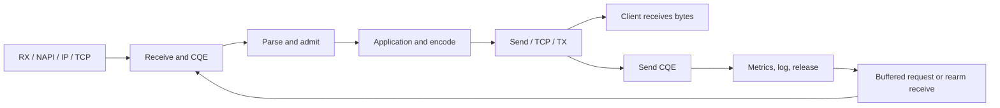

**Request-path experiments and updated cost budget — 2026-09-11**

> Artifact retention: [Run summaries and setup records](runs/README.md) are retained.
> Raw traces, binaries, profiles, and source snapshots were removed.
> Artifact paths and restoration commands below describe the original runs.

The remaining local experiments are complete. The working tree now retains
direct response-header writes, vectored header/body sends, bounded stream and
pipeline batching, specialized access-record formatting, and active-slot deadline
scans. Compared with the previously retained implementation, these changes reduce
process CPU by **3–4% for small GETs, 9% with access logging, 17% for 64 KiB echoes,
and 41–50% for the demo stream** in the matched workloads below. Buffered pipeline
throughput increases **2.36–2.55×**, with a CPU tradeoff on fragmented input.

The strongest remaining leads are **multishot receive integration and network/CPU
placement**. Registered sockets, SQ polling, larger default receive buffers,
whole-response templates, and owner-only logger counters do not justify further
default-path work on this evidence. The kernel is **not capped**.

This pass covers the original suggestions table
and the remaining alternatives in the [initial review](request-critical-path.md).
The baseline includes the optimizations from the [previous pass](critical-path-experiments.md).
Percentages are incremental to that baseline; do not add them to earlier percentages.
The [coverage ledger](runs/request-path-remaining.json "Summary of docs/request-path-remaining/coverage.json; raw artifact retired") records every concern,
including the distinction between HTTP tests and standalone kernel prototypes.

All experiments are local, as requested. Veth tests use two disposable network
namespaces on the same kernel. Physical NIC DMA, hardware queues, IRQ placement,
RSS, interrupt coalescing, and hardware zero-copy receive remain unmeasured.
No host interfaces or network tunables were changed.

**Matched results for the integrated source**

Zig 0.16.0, ReleaseSafe, x86-64-v3; Ryzen AI MAX+ 395, Linux
7.2.4-arch1-2-strixhalo. Unless specified otherwise, one worker runs on CPU 2,
64 clients on CPUs 4–7, with 256 public slots and connection turnover disabled.
Each workload has three alternating-order trials. Warmup is two seconds and the
reported offered-rate phases are six seconds. CPU benchmarks ran sequentially.
These short shared-host trials establish local behavior, not sustained capacity
or production latency guarantees.

| Workload | Offered rate | Baseline CPU/response | Integrated CPU/response | Reduction | Client service p99, before → after |
|---|---:|---:|---:|---:|---:|
| Small GET, no access log | 100k/s | 1.440 µs | 1.380 µs | 4.2% | 127 → 124 µs |
| Small GET, no access log | 300k/s | 1.520 µs | 1.480 µs | 2.6% | 132 → 126 µs |
| Longer-header POST | 300k/s | 2.253 µs | 2.233 µs | 0.9% | 182 → 184 µs |
| GET with access log to tmpfs | 100k/s | 1.980 µs | 1.800 µs | 9.1% | 150 → 135 µs |
| 64 KiB echo | 20k/s | 8.302 µs | 6.901 µs | 16.9% | 309 → 237 µs |
| Demo chunked stream | 20k/s | 4.401 µs | 2.200 µs | 50.0% | 232 → 97 µs |
| Demo chunked stream | 100k/s | 5.140 µs | 3.040 µs | 40.9% | 379 → 204 µs |
| 4,096 clients, 8,168 public slots | 150k/s | 3.281 µs | 3.271 µs | 0.3% | 1,229 → 750 µs |

CPU/response is sampled **process CPU divided by successful response rate**,
not latency. Service latency starts when the client attempts the request;
intended-offer latency also includes generator scheduling delay. The stream's
intended-offer p99 at 100k/s increased from **0.506 to 1.171 ms**, despite lower
service latency. Neither CPU savings nor this table implies a universal tail
improvement. The large-connection warmup includes establishing connections and
is excluded from the comparison.

[Small GET](runs/request-path-remaining.json "Summary of docs/request-path-remaining/combined-small/summary.json; raw artifact retired"),
[headers](runs/request-path-remaining.json "Summary of docs/request-path-remaining/combined-headers/summary.json; raw artifact retired"),
[logging](runs/request-path-remaining.json "Summary of docs/request-path-remaining/combined-logging/summary.json; raw artifact retired"),
[echo](runs/request-path-remaining.json "Summary of docs/request-path-remaining/combined-echo/summary.json; raw artifact retired"),
[stream](runs/request-path-remaining.json "Summary of docs/request-path-remaining/combined-stream/summary.json; raw artifact retired"),
[many connections](runs/request-path-remaining.json "Summary of docs/request-path-remaining/combined-many/summary.json; raw artifact retired").

The post-warmup phases of those six workloads had no HTTP or transport failures.
One baseline large-connection warmup recorded 1,314 dial timeouts while opening
the client population; that startup phase is excluded, not counted as a clean run.
The logging runs parsed
about 730,000 access records per trial. The integrated build recorded **157, 14,
and 0 dropped events**, versus zero in the matching baseline trials: at worst
about 0.022% of events. The queue remains bounded and lossy; this is not evidence
of lossless logging. The independent formatting benchmark also shows a clear
gain, **187 → 67 ns per record**, without involving the sink.

Overall server-core utilization supports the main transport savings: at 20k/s
echo it fell from **24.1% to 20.9%**, and at 100k/s stream from **86.8% to 57.6%**.
For small GET at 300k/s it fell only **81.4% to 80.2%**. Process CPU omits some
softirq and kernel-thread work; overall core activity includes unrelated work.
Neither isolates the complete server-attributable kernel budget.

The additional one-pair overload check preserved roughly **150.15k successful
responses/s** with a 150k rate limit and 300k offered load. Both versions shed
excess traffic and recovered to about 100k/s, with three residual EOFs in each
recovery phase. CPU per success during shedding was about 4.209 µs in both.
This checks bounded overload/recovery behavior, not failure-free overload.
[Overload evidence](runs/request-path-remaining.json "Summary of docs/request-path-remaining/combined-overload/summary.json; raw artifact retired").

**Pipeline batching has a workload-dependent tradeoff**

The validated Go client uses 64 connections, bounded synchronous request batches,
one second of warmup and five seconds of measurement. All approximately 92.8
million measured responses across the 24 runs were validated. These are closed-loop
throughput measurements; this client does not collect per-request latency quantiles.

| Pipeline depth / client write size | Baseline responses/s | Integrated responses/s | Baseline CPU/response | Integrated CPU/response |
|---|---:|---:|---:|---:|
| 1 / complete batch | 517k | 531k | 1.230 µs | 1.200 µs |
| 8 / complete batch | 592k | 1.395M | 1.078 µs | 0.627 µs |
| 32 / complete batch | 609k | 1.554M | 1.040 µs | 0.579 µs |
| 8 / writes of at most 8 bytes | 464k | 523k | 1.383 µs | 1.449 µs |

The fragmented case gains 12.6% throughput but uses **4.8% more CPU per response**.
Write boundaries are a client workload control; TCP can merge them. Revisit the
batching policy if fragmented pipelines dominate deployment traffic. Depth-one
traffic and buffered pipelines benefit in these trials.
[Combined summaries](runs/request-path-remaining.json "Summary of docs/request-path-remaining/final-summary.json; raw artifact retired"),
raw pipeline trials.

The implementation uses `MSG_MORE` only for small public responses when another
complete request head is already buffered. It preserves response order, caps the
sequence at 15 hinted sends, and flushes before waiting for further input. Admin,
interim, closing, large borrowed-body, and unfinished streaming responses are
excluded. It still performs a send/completion per response; the gain comes from
allowing TCP output batching. Setting `TCP_NODELAY` explicitly pushes pending
output before a receive wait, as documented by [tcp(7)](https://man7.org/linux/man-pages/man7/tcp.7.html).
Send-completion metrics continue to measure local handoff, not delivery to the client.

**Updated critical-path budget**

This is the established, warm HTTP/1.1 small-GET path, with no TLS or access log.
The measured process anchor is now **1.38–1.48 µs/response** at 100–300k/s in the
offered-rate trials above. Queueing, scheduling, and network transit add latency.
Measured components use hot state; kernel rows remain engineering estimates.
Boundaries overlap: **do not sum the rows or treat a range endpoint as a profile**.



| Step | Best current cost guess | Assessment / stop condition |
|---|---:|---|
| Physical RX, driver/NAPI, IP/TCP input, optional firewall | 0.2–1.5 µs, estimated | **OPEN / physical path unmeasured.** Veth placement has a material effect; see below. |
| Kernel receive, socket lookup, copy, completion | 0.15–0.9 µs, estimated | **OPEN.** Multishot prototype is promising for small messages; fixed descriptors and 64 KiB buffers did not help HTTP defaults. |
| CQE dispatch and userspace SQE bookkeeping | 0.05–0.3 µs, estimated | **PARK incremental tuning.** Private ring and indexed tokens already avoid shared queues. Reopen with a specific profile or ownership redesign. |
| Incremental head parsing and reset | ~168 ns small; ~765 ns longer benchmark head, measured in previous pass | **CONDITIONAL.** Keep vector validation/copy improvements. Further parser work needs representative headers and a whole-server gain. The component header differs from the offered-rate header workload. |
| Admission acquire/release arithmetic | 1.2–1.6 ns, measured | **CAPPED** for owner-local arithmetic; preserve admission and overload behavior. |
| Built-in application selection | 13.6 ns, measured | **CAPPED** for this handler; custom applications are unrestricted by this number. |
| Response validation, encoding and tiny body copy | 55.9 ns, measured | **PARK** further root-template specialization; only ~6 ns whole-server gain beyond direct writes in its isolated comparison. |
| Request lifecycle clock reads | ~82 ns for five reads, plus loop-amortized reads | Four monotonic and one realtime call, ~16.4 ns each. Redundant calls already removed. **CAPPED mechanism; PARK further semantic reuse.** |
| Counters and histogram recording | 10–60 ns total, estimated; <1 ns per measured histogram observation | **CAPPED arithmetic.** Cold cache lines and concurrent snapshots remain workload-dependent. |
| Kernel send, copy, TCP output and TX enqueue | 0.3–1.8 µs, estimated | **OPEN.** Gather sends and batching demonstrably reduce aggregate cost. Ordinary sends remain appropriate here. |
| Ring entry/submission/task work, amortized | 0.05–0.8 µs, estimated | Keep cooperative task work. **PARK** previously tested wait merging/deferred work and new SQ polling for this default. Kernel execution itself is not capped. |
| Completion housekeeping and next-exchange preparation | 0.03–0.15 µs, estimated, excluding the clocks/parser above | **PARK** instruction shaving; retain lifetime accounting. |
| Deadline/control maintenance | ~11–14 ms process-thread runtime per 10 idle seconds with 4,096 connections, measured in two refined active-list trials | Scan active slots. **PARK timer wheel** at this cost; no per-request timer update was added. |
| Access record format/enqueue, when enabled | 67 ns measured, plus ~16 ns realtime read | Keep specialized formatter with general fallback. **PARK** counter-atomic substitution. |
| Log drain, when enabled | Sink-dependent; no separately isolated per-record CPU estimate | Up to 16 records/write from the prior pass. At 100k/s the current matched logged/no-log process difference is ~0.42 µs/response, a cross-workload indication including formatting, clocks, and I/O, not a pure sink cost. |

[Current component results](runs/request-path-remaining.json "Summary of docs/request-path-remaining/retained-costs.json; raw artifact retired"),
[earlier parser/admission evidence](critical-path-experiments.md),
[original kernel estimates and boundaries](request-critical-path.md).
A local send CQE is not an ACK or delivery measurement. Physical wire serialization
still has the floor `bytes * 8 / link_bits_per_second`, with propagation and queues
additional; a fixed byte count and link rate cap that narrow cost.

**Every remaining alternative and the decision**

“CAPPED” stops work on a narrow measured concern unless the workload changes.
“PARK” stops pursuing the particular candidate on current evidence. “OPEN” means
the experiment leaves a credible next step; it does not imply production readiness.

| Candidate | Experiment and outcome | Decision |
|---|---|---|
| Direct header writes/common status | Encoding 77.5 → 55.9 ns in the final component comparison; small whole-server gain | **KEEP.** Validation, generic headers, and other statuses preserved. |
| Whole built-in response template | Component 36.8 ns; at 300k/s baseline/plain/template CPU 1.520/1.487/1.480 µs | **PARK.** ~6 ns beyond general direct writes does not justify coupling transport to the root representation. |
| `SENDMSG` for headers + borrowed body | Echo submissions ~7 → 6/request; final CPU 8.302 → 6.901 µs | **KEEP.** Persistent two-entry iovec/msghdr; partial completions advance both regions correctly. |
| Coalesce synchronous stream fragments | Demo sends 5 → 2; total submissions ~6 → 3/request | **KEEP.** Initial headers send promptly; bounded output and at most 16 producer calls per fill. |
| Bounded pipeline output batching | 2.36–2.55× throughput for complete batches; fragmented case +4.8% CPU/response | **KEEP with the recorded tradeoff.** Explicit flush before input waits. |
| Specialized access-record formatting | 187 → 67 ns; combined logged GET ~9% less process CPU | **KEEP.** Escaped methods, worker identity, other event shapes, and overflow accounting preserved. |
| Owner-only logger counters | 100k/s 1.960 → 1.960 µs; no component advantage | **PARK.** No whole-path benefit from this additional specialization. |
| Active-slot deadline scans | Isolated busy-pool CPU 3.285 → 3.203 µs; final combined busy-pool CPU effectively flat | **KEEP** O(active) scan and tiny idle-cost reduction; **PARK** further timer restructuring. |
| Registered socket files | 300k/s 1.514 → 1.520 µs; two startup compatibility tests fail | **PARK.** No default gain; per-worker sparse tables consume registration resources. |
| Receive buffer 16 → 64 KiB | Echo submissions ~7 → 4, but CPU stays ~8.30 µs; process RSS +~13 MB at 264 slots | **PARK default increase.** Fewer SQEs alone is insufficient. |
| `SEND_ZC` for large bodies | Process CPU falls ~8.30 → 6.30 µs, but server-core busy rises ~24.7% → 28.7%; all usage notifications report copying | **PARK locally.** Not a whole-CPU or zero-copy win. Physical payload crossover remains open. |
| Provided buffers + multishot receive | Veth TCP probe: 64-byte CPU 1.670 → 1.342 µs; 64 KiB 4.025 → 4.182 µs | **OPEN, prototype only.** Next meaningful transport project is bounded HTTP integration. |
| Multishot accept | At 30k connections/s CPU 3.933 → 3.803 µs; pressure reduces drops but raises latency and lowers delivered goodput | **CONDITIONAL / PARK default.** Reopen for demonstrated accept loss under the deployment's latency budget. |
| Listen backlog 128 → 4096 | Pressure trials eliminate listen drops and transport failures, but service p99 2.13 → 7.86 ms at nominal 200k/s | **CONDITIONAL.** Useful availability/queueing tradeoff; not a capacity increase. Default stays 128. |
| Direct accept/fixed I/O/direct close | Corrected serial TCP probe median CPU 3.865 → 4.165 µs per new connection/exchange | **PARK.** Reopen for measured descriptor-table contention at larger scale. |
| SQ polling on an additional core | 300k/s process CPU 1.514 → 3.481 µs; poll core 100% busy, service p99 131 → 107 µs | **PARK default.** Requires an explicit latency objective worth dedicating a CPU. |
| Socket and ring NAPI busy poll | 50 µs settings accepted; incoming NAPI ID stays zero, including veth | **UNAVAILABLE effective test here.** Do not infer that physical busy polling is capped. |
| Local placement / GRO / worker count | Cross-L3 client placement adds ~52% server process CPU/request; more workers lower service p99 at fixed load but raise aggregate process CPU | **OPEN / deployment-dependent.** See controlled local results below. |

Supporting isolated comparisons:
[encoding](runs/request-path-remaining.json "Summary of docs/request-path-remaining/encoding/summary.json; raw artifact retired"),
[template](runs/request-path-remaining.json "Summary of docs/request-path-remaining/response-template/summary.json; raw artifact retired"),
[gather send](runs/request-path-remaining.json "Summary of docs/request-path-remaining/gather_send/summary.json; raw artifact retired"),
[stream](runs/request-path-remaining.json "Summary of docs/request-path-remaining/stream/summary.json; raw artifact retired"),
[formatting](runs/request-path-remaining.json "Summary of docs/request-path-remaining/log-format/summary.json; raw artifact retired"),
[counters](runs/request-path-remaining.json "Summary of docs/request-path-remaining/log_counters/summary.json; raw artifact retired"),
[active slots](runs/request-path-remaining.json "Summary of docs/request-path-remaining/active-slots/summary.json; raw artifact retired"),
[fixed files/SQ polling](runs/request-path-remaining.json "Summary of docs/request-path-remaining/fixed-and-sqpoll/summary.json; raw artifact retired"),
[receive size/zero-copy](runs/request-path-remaining.json "Summary of docs/request-path-remaining/receive-and-zc/summary.json; raw artifact retired").
These isolated candidates are compared to their own matched baseline, not added
together to predict the integrated result.

**Kernel findings that change the priorities**

The [C TCP probe](../bench/kernel_path.c) validates echoed bytes and measures
server thread CPU with `CLOCK_THREAD_CPUTIME_ID`. It excludes HTTP parsing,
application work, admission, server timers, and concurrent connection pressure.
Three veth trials gave these medians:

| Probe | Server CPU/exchange | Wall time/exchange |
|---|---:|---:|
| Ordinary receive, 64 bytes | 1.670 µs | 4.848 µs |
| Provided-buffer multishot receive, 64 bytes | 1.342 µs | 3.461 µs |
| Ordinary receive, 64 KiB | 4.025 µs | 15.690 µs |
| Provided-buffer multishot receive, 64 KiB | 4.182 µs | 16.182 µs |
| Zero-copy send API, 64 KiB | 4.023 µs | 18.683 µs |

Probe source/build provenance,
raw results.
The nonincremental provided-buffer ring has 128 buffers of 64 KiB and keeps each
fragment until its send completes. This largely serial workload does not establish
pool-exhaustion behavior under HTTP concurrency. An HTTP implementation must bound
queued input while writing, preserve backpressure, return buffers correctly, rearm
after exhaustion, and distinguish multishot continuation from terminal/cancellation
CQEs. Multishot removes receive submissions, not receive CQEs. See the
[receive contract](https://raw.githubusercontent.com/axboe/liburing/master/man/io_uring_prep_recv.3).

The HTTP zero-copy prototype passed TCP tests and retained memory until its
notification, including cancellation/shutdown. That ownership requirement follows
the [send notification contract](https://raw.githubusercontent.com/axboe/liburing/master/man/io_uring_prep_send_zc.3).
Usage instrumentation reported **151,999/151,999 copied notifications on loopback**
and **151,991/151,991 across veth**. This agrees with the kernel's documented local
delivery restriction, explicitly including veth across namespaces. Deferred copies
can move work outside the sending process's charged CPU; the lower process figure
therefore does not establish a total saving. See
[kernel zero-copy documentation](https://docs.kernel.org/networking/msg_zerocopy.html),
loopback counters, and
veth counters.

SQ polling likewise needs accounting beyond the event-loop thread. At 300k/s the
event-loop CPU was about 25% busy while the poll CPU was 100% busy, versus roughly
81% on the ordinary single server CPU. Process accounting on this kernel charges
much of that additional work too. The prototype also needed different fatal cleanup:
publish outstanding SQEs, wait until the polling thread consumes them, then cancel.
It is not merely a setup-flag change.

Registered-file tests passed 44/46 TCP cases; the low-descriptor-limit startup
case and sixteen-worker large-pool startup case failed with resource errors.
Table registration has quota and lifetime implications described by
[liburing](https://raw.githubusercontent.com/axboe/liburing/master/man/io_uring_register_files.3).
The corrected direct-accept probe avoids `SOCK_CLOEXEC`, which direct descriptors
reject, and avoids an extra per-connection NAPI query in only one arm. Ordinary
accept/receive/send plus synchronous close used less CPU than direct descriptors
with a separate direct-close SQE. See the
[accept contract](https://raw.githubusercontent.com/axboe/liburing/master/man/io_uring_prep_accept.3)
and [corrected runner records](runs/request-path-remaining.json "Summary of docs/request-path-remaining/final-runs.json; raw artifact retired").

Both socket `SO_BUSY_POLL` and ring NAPI registration succeeded at 50 µs. Incoming
NAPI ID zero means no eligible queue was demonstrated, so the near-equal timings
do not test effective hardware busy polling. Its applicability depends on the
receive path, described in the [NAPI documentation](https://docs.kernel.org/networking/napi.html)
and [ring API](https://raw.githubusercontent.com/axboe/liburing/master/man/io_uring_register_napi.3).
Kernel hardware profiling was unavailable with this session's permissions;
per-function nanosecond attribution is still uncertain.

**Local network and connection pressure**

These HTTP veth tests use the comparison baseline, 200k offered GETs/s, no access
log, three trials each. “Same L3” uses server CPU 2 and client CPUs 4–7; “other L3”
uses client CPUs 8–11. The host has one NUMA node. Multiple workers share an allowed
CPU set; workers are not individually pinned.

| Placement/configuration | Process CPU/response | Mean busy fraction per allowed server CPU | Service p99 |
|---|---:|---:|---:|
| One worker, same L3, GRO enabled | 1.720 µs | 59.0% | 53 µs |
| One worker, other L3, GRO enabled | 2.610 µs | 91.6% | 244 µs |
| One worker, same L3, GRO disabled | 1.710 µs | 55.6% | 77 µs |
| Two workers, CPUs 2–3 | 1.920 µs | 35.0% | 28 µs |
| Four workers, CPUs 0–3 | 2.130 µs | 20.0% | 24 µs |

[Network summary](runs/request-path-remaining.json "Summary of docs/request-path-remaining/network/summary.json; raw artifact retired").
Cross-L3 placement costs about 52% more process CPU/response. Cache handoff is a
plausible explanation, not isolated causal proof; local packet work also follows
client placement. Two and four workers lower service tails at the same offered
rate while using more aggregate process CPU and memory. Every configuration
delivers about 200k/s, so this does not measure capacity scaling. GRO's small-request
CPU difference is negligible here; larger payloads and hardware offloads remain
separate questions. Follow the kernel's [scaling guide](https://docs.kernel.org/networking/scaling.html)
when later evaluating actual NIC queues and worker placement.

Fresh per-trial loopback namespaces isolate the churn comparison. At 30k new
connections/s all three versions completed without transport failures; multishot
accept saved about 3.3% CPU. With 512 clients and 2,048 slots, the nominal 200k/s
pressure phase gave:

| Accept policy | Successful responses/s | CPU/success | Service p99 | Intended-offer p99 | Listen drops over each complete trial |
|---|---:|---:|---:|---:|---|
| Ordinary accept, backlog 128 | 164k | 3.879 µs | 2.13 ms | 10.75 ms | 3,446–4,482 |
| Multishot accept, backlog 128 | 155k | 4.097 µs | 4.88 ms | 12.98 ms | 10–71 |
| Ordinary accept, backlog 4096 | 160k | 4.003 µs | 7.86 ms | 14.81 ms | 0 |

The larger backlog eliminated transport failures in all three complete trials,
but added queueing and did not increase delivered goodput. The client left roughly
17–23% of scheduled offers unsent at this pressure, depending on the variant;
none establishes 200k/s connection capacity. Recovery reached roughly 20k/s
without transport failures. Default backlog and ordinary accept stay unchanged;
the backlog patch remains reviewable for a
deployment that prefers waiting to connection failure.
[30k/s trials](runs/request-path-remaining.json "Summary of docs/request-path-remaining/churn-isolated/summary.json; raw artifact retired"),
[pressure/recovery trials](runs/request-path-remaining.json "Summary of docs/request-path-remaining/churn-pressure/summary.json; raw artifact retired").

Timer work is substantially below the initial estimate: at 4,096 idle connections,
two refined 10-second trials recorded **17.48/15.91 ms** thread runtime for baseline
and **10.59/14.05 ms** for active-slot scans. This includes other idle worker work,
not just deadline scanning. It is about 0.1–0.2% of a core; a timer wheel is not
justified. Coarser `/proc` CPU readings quantize to 10 ms, so a recorded zero is
not zero cost. The ~1.38 GB RSS for 8,176 configured total slots remains a separate
memory-capacity concern. Idle trials.

**What is capped, and what would reopen work**

Keep **CAPPED** labels on admission arithmetic, histogram classification, the
tiny built-in application, per-request allocation overhead (there are no such
allocations), O(1) free-slot lookup, cached Date formatting, and the six-byte body
copy already sharing its header send. Changes need a new profile or a materially
different workload to reopen those narrow areas.

Do not apply those labels to custom handlers, overall parser cost, buffer memory,
large payload copying, snapshot contention, connection establishment, logging
reliability, or the kernel/network path. The next useful local transport experiment
is an HTTP multishot-receive implementation with bounded ownership and the full
TCP suite, followed by matched small/fragmented/large/overload workloads. Physical
busy polling, zero-copy crossover, IRQ/RSS/coalescing, and NIC scaling await a
separate load-generator host; further loopback flag tuning cannot resolve them.

**Correctness and reproducibility**

The integrated source passed **50 component tests** in ReleaseSafe on x86-64-v3
and baseline CPU targets, and Debug on the baseline target. All **47 TCP tests**
passed in ReleaseSafe and Debug, including partial I/O, slow readers, blocked
logging, overload recovery, multi-worker startup, cancellation, and full submission
queues. The existing harness suites passed **15 tests**. `zig fmt --check` passed.
Candidate checks,
integrated build/Debug/harness checks.

New specifications verify stable producer-buffer capacity, deferred fragment
ownership/order, bounded producer calls, empty-fragment rejection, JSON escaping,
fallback fields, and log overflow accounting. Existing tests retain their behavior;
two component fixtures now initialize active-list membership. The prompt pipeline
flush test passes on both baseline and retained source and fails on a deliberately
broken batching variant without the flush. It guards an optimization hazard,
not a claim of a preexisting baseline bug.
Expected mutant failure,
baseline TCP run.
Parser sources are unchanged from the previous pass's 101,814-run fuzz validation.

The initial shared-namespace churn series had widespread timeouts, including
startup, and is excluded. Fresh namespaces and a larger source-address pool fixed
the experiment; they do not prove the earlier root cause. An initial idle-client
run hit the harness descriptor limit and was rerun after raising only its own soft
limit within the inherited hard limit. Failed runs are preserved, and failed
registered-file compatibility tests are not waived. The earlier pass's invalid
shared-cache builds remain excluded as documented there.

The baseline is archived as source and
[hashes](runs/request-path-remaining.json "Summary of docs/request-path-remaining/baseline-hashes.json; raw artifact retired"). The final five-file
patch changes three runtime implementations,
clarifies the producer-lifetime documentation, and adds one TCP test. Main source
hashes were checked before integration. The executable implementation matches the
measured candidate; the sole subsequent source difference is that documentation
clarification, verified by restoring the old comment in memory and checking its
hash. The measured server SHA-256 is
`6ca2a9628ff02f4516577b7ed0bf5e844754f1203ab4a405726c916fc50809e5`.
[Measured build](runs/request-path-remaining.json "Summary of docs/request-path-remaining/retained_candidate-build.json; raw artifact retired"),
[integration record](runs/request-path-remaining.json "Summary of docs/request-path-remaining/integration.json; raw artifact retired"),
[workspace build](runs/request-path-remaining.json "Summary of docs/request-path-remaining/main-build.json; raw artifact retired").
Each source tree uses its own Zig local cache and an explicit compiler module root.
The workspace build is recorded separately because build paths can affect binary
hashes. Applying the patch to the baseline archive was verified to reconstruct
every tracked source/test file exactly. The now-retired final source archive
captured that result. Summarized trials, commands, hashes, and
[runner exits](runs/request-path-remaining.json "Summary of docs/request-path-remaining/final-runs.json; raw artifact retired") are retained alongside the report.

The original reconstruction procedure required the now-retired source archive and patch:

```sh
experiment_tree=$(mktemp -d /tmp/zhtps-request-path.XXXXXX)
tar -xzf docs/request-path-remaining/baseline.tar.gz -C "$experiment_tree"
patch -d "$experiment_tree" -p1 < docs/request-path-remaining/retained.patch
cd "$experiment_tree"
zig build test test-wire --release=safe -Dcpu=x86_64_v3
```

See [bench/README.md](../bench/README.md) for local veth, pipeline, kernel-probe,
and matched-variant commands. The optional C probe links liburing. The measured Zig snapshot had no package
dependencies; the current server uses zeit for calendar and wall-clock operations.
